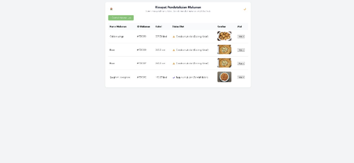

# Diet Assistant 🥗🤖

    

**AI-powered web app** for meal classification and personalized dietary tips, leveraging a TensorFlow model trained on 101 food categories. 🎯

---

## ✨ Features

* 🔍 **Instant Meal Recognition**: Upload a photo and identify meals across 101 classes in seconds.
* 📊 **Tailored Recommendations**: Receive nutrition guidelines based on recognized meal type.
* 🌐 **Responsive UI**: Built with Flask, HTML5, CSS3, and vanilla JavaScript.

---

## 🛠️ Technologies Used

* **Backend:** Flask
  Python framework for routing, processing input, and providing APIs to the frontend. Manages temporary image storage and interacts with the Nutritionix API.

* **AI Model:** Convolutional Neural Networks (CNN)
  Deep learning model trained on over 100 food categories, classifying uploaded meal images.

* **Frontend:** HTML5, CSS3, JavaScript
  Constructs a simple, user-friendly interface; handles image uploads and real-time prediction requests.

* **Nutritionix API:** External service for nutritional data, delivering information on calories and macronutrients based on model predictions.

* **Supporting Python Libraries:**

  * TensorFlow/Keras: Loading and running the CNN model
  * NumPy: Image data normalization and transformation
  * Requests: Accessing the Nutritionix API
  * Logging & OS: Debugging and file management

* **Database:** MySQL / PostgreSQL
  Stores user information (Users), prediction history (History), and local nutrition data (NutritionData).

---

## 🚀 Application Workflow

1. **Authentication (Sign Up / Sign In)**

   * **Sign Up:** New users submit `{username, email, password}`, data saved to `Users` table, then redirected to Sign In.
   * **Sign In:** Users enter `{email, password}`, verified, session/token generated, and Dashboard displayed.

2. **Image Preprocessing**

   * Resize uploaded image to model requirements.
   * Normalize pixel values for consistent input scale.

3. **Meal Prediction (CNN)**

   * Processed image is classified by the CNN model into one of 101 food categories.
   * Model returns the top label (e.g., “Nasi Goreng”) with its probability.

4. **Calorie Estimation**

   * Retrieve calorie value per 100g from the nutrition database based on the predicted label.
   * Display calories standardized to 100g.

5. **Diet Recommendation**

   * If calories ≤ 200 kcal: “Good for diet”.
   * If calories > 200 kcal: “Not recommended for diet”.

6. **History Storage**

   * Record each prediction and recommendation in the `History` table for future retrieval.

---

## 🌐 Web Interface

## 📄 License

Distributed under the MIT License. See [LICENSE](LICENSE) for details.
